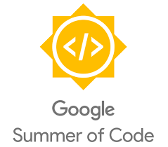

# A to Z Resources for Students 

# Google Summer of Code

## 1. List of Top Orgranisation in GSOC
### a. Mozilla

### b. The Apache Software Foundation (Java, C, Erlang)

### c. Django Software Foundation(Python, Django)

### d. FossAsia(Java, Javascript)

### e. Git (C, Shellscript)

### f. Gnome (C, Python, Javascript)

### g. Institute for Artificial Intelligence (C++, Python)

### h. Metasploit (Ruby, Python ,C)

### i. Teammates (Java, Google Cloud Engine)

## 2. Explanatory videos
### a. [How to prepare for GSoC? by a GSoC student - I.O. Stream](https://www.youtube.com/watch?v=u0IPiGhpwRE&t)
### b. [Approaching an organisation - I.O. Stream](https://www.youtube.com/watch?v=KIPDtVRMIuE&list=PL9oUnF4b_qbXrxhlgDxo5VX5DVj08HuDE&index=4)
### c. [GSOC - GeeksForGeeks](https://www.youtube.com/watch?v=k7go4SZFPxQ)
### d. [GSOC 2019: Beginner's Guide from a 2 time GSOC student | ft. Akshay Deep](https://www.youtube.com/watch?v=u0IPiGhpwRE)
### e. [GSOC 2019: Solving Bugs and Proposal Preparation | ft. Akshay Deep](https://www.youtube.com/watch?v=uyoRe5SovWQ)
### f. [How to prepare for Google Summer of Code GSoC [Hindi/Hinglish]](https://www.youtube.com/watch?v=RpdjewNuPzc)

## 3. Blogs/Articles
### a. Cracking Google Summer of Code 101 (https://www.geeksforgeeks.org/google-summer-of-code-101/)

# COMING SOON

- TODO
