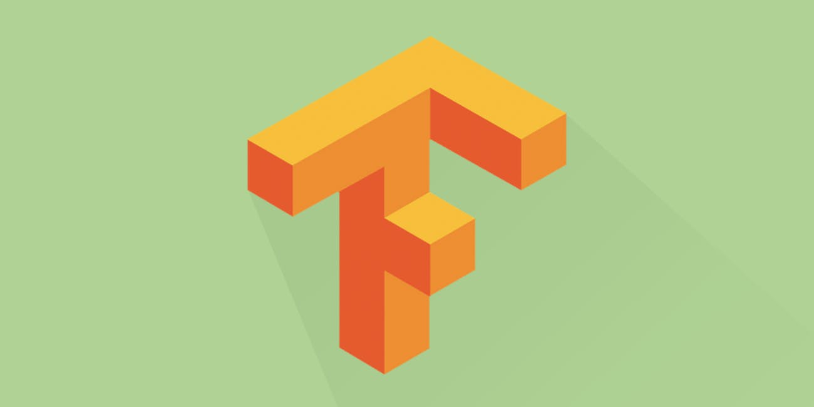

# A to Z Resources for Students 

# Machine Learning, Deep Learning, Artificial Intelligence

## Table of Contents

1.  [Machine Learning](#1-machine-learning)
     
     - [Where to Start in ML ?  ](#1.1-where-to-start-in-ml)
     - [Online Courses](#1.2-online-courses)
     - [Research Paper](#1.3-research-paper)
     - [Top Github Repositories](#1.4-top-github-repositories)

2.  [Deep Learning](#2-hackathons-and-events)

     - [Where to Start in DL?](#2.1-where-to-start-in-ml)
     - [Online Courses](#2.2-online-courses)
     - [Research Paper](#2.3-research-paper)
     - [Top Github Repositories](#2.4-top-github-repositories)
    
2. [DataSets](#2-datasets)

5. [Data Science Conference]()

4. [Celebrities in ML and AI world]()

6. [Tips for ML & AI enthusiasts]()

---

# 1.  **Machine Learning**

## COMING SOON
