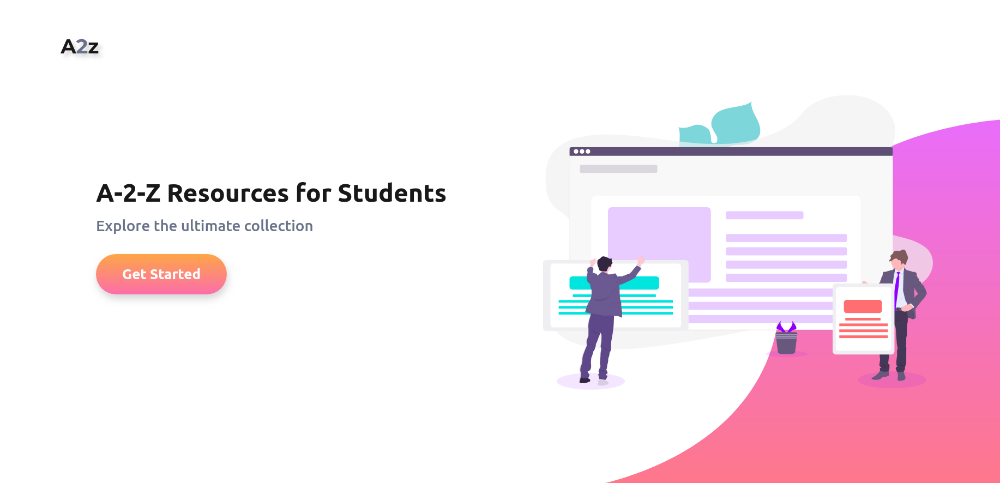

# A to Z Resources for Students 

<a href="http://bit.ly/3o0ruod"  target="_blank" > 
	  Join Whatsapp Community </a>

## **Version 2 of A to Z Resource Coming Soon, Click this link and get notified when it available**  - [NOTIFY ME FOR EARLY ACCESS](https://dipakkr.substack.com/)

This repository is created and curated by Deepak Kumar ( [Twitter](https://twitter.com/HQdeepak) ). There are more than 500+ individual contributors have  helped creating this repository. We can see the list of contributors at [Contributors](CONTRIBUTORS.md) page.

If you think this repository helped you in any in finding new opportunities, tag me on Twitter( @HQdeepak ) and help it reach more people in the community. 

[Buy Me a Coffee](https://www.buymeacoffee.com/dipakkr)

---

### Are you a college student or a working professional looking for resources to learn a new coding language? Are you looking to meet new people in your community or searching for global conferences, hackathons and competitions to attend? If so, you should definitely check this out.

When I was in college, I missed a lot of opportunities like hackathons, conferences, internships and many global events due to lack of awareness. I don't want the emerging developers to suffer the same as me. Hence, I and a bunch of other developers around have collected a list of resources for students. If you are in college, a college graduate, or just starting out as a developer, you should definitely check it out!

*Image credits: Google*

## Table of Contents :clipboard:

1.  [Coding Resources - How to learn xyz ](#1-coding-resources)

     - [Python](#11-python)
     - [Machine Learning](#12-machine-learning)
     - [Deep Learning](#13-deep-learning)
     - [Android Development](#14-android-development)
     - [Backend Development ](#15-backend-development)
     - [Frontend Web Development](#16-frontend-web-development)
     - [Full-stack Web Development](#122-full-stack-web-development)
     - [Data Structures](#17-data-structures) 
     - [Alexa Tutorials](#18-alexa-tutorials)
     - [C Language](#19-c-language)
     - [C++ Language](#110-c-language)
     - [Git and Github](#111-git-and-github)
     - [R Language](#112-r-language)
     - [Haskell](#113-haskell)
     - [MongoDB](#114-mongodb)
     - [Prolog](#115-prolog)
     - [C# Language](#116-c-language)
     - [DevDocs](#117-devdocs)
     - [Docker](#118-docker)
     - [Microsoft Technologies](#119-microsoft-technologies)
     - [Scala](#120-scala)
     - [Programming Notes for Professionals](#121-programming-notes-for-professionals)
     - [MATLAB/Octave](#122-matlaboctave)
     - [Go Language](#123-go-language)

2.  [Hackathons and Events](#2-hackathons-and-events)
     - [Top Global Hackathons](#21-top-global-hackathons-)
     - [Competitions](#22-competitions-)
     - [Hackathon Search Portal](#23--hackathon-search-portals-dart)
     - [Events](#24-events-)
     - [Startup Summits and Competitions](#25-startup-summits-competitions-and-bootcamps-neckbeard)
     - [Hiring Challenges](#26-hiring-challenges)

3.  [Student Benefits and Programs](#3-student-benefits-and-programs-fire)
     - [Campus Ambassador Programs](#campus-ambassador-programs-v)
     - [Student Benefits and Packs](#student-benefits-and-packs-v)
     - [Student Fellowship Programs](#student-fellowship-programs-v)
     - [Scholarships](#scholarships-runner)

4.  [Open Source Programs](#4-open-source-programs)
5.  [Startup Programs and Incubators](#5-startup-programs-and-incubators-mag_right)
6.  [Internship Portals](#6-internship-programs)
7.  [Developer Clubs and Meetups](#7-developer-clubs-and-meetups)
8.  [Conferences for students](#8-conferences-bookmark_tabs)
9.  [Top People to Follow](#9-top-people-to-follow)
10. [Top Websites to Follow](#10-top-websites-to-follow)
11. [Top 50 YouTube Channels to Follow](#50-top-youtube-channels)
     - [Top 10 in Technology](#111-top-10-in-technology)
     - [Top 10 in Startup](#112-top-10-in-startup)
     - [Top 10 in Design](#113-top-10-in-design)
     - [To 10 in Business](#114-top-10-in-business)
     - [Top 10 in Finance](#115-top-10-in-finance)
12. [Additional Links](#12-additional-links-hamster)
13. [Bootcamps](#13-coding-bootcamps)
14. [Miscellaneous Resources](#14-miscellaneous-resources)
     - [Design Resources](#141-design-resources)
     - [Podcasts](#142-podcasts)
15. [Top sites for APTITUTE PREPARATION FOR PLACEMENTS]
16. [Contributors](CONTRIBUTORS.md)
---

# FYI

- Are you just getting started? Look for the :baby: emoji. It highlights resources for absolute beginners.
- Some resources are recommended for _everyone_, so they have a :star: emoji.
- Willing to spend some money to improve your skills?  :heavy_dollar_sign: indicates paid content.

---

# 1. Coding Resources

## 1.1 Python

> [**Browse this link for detailed information on Python**](Python/Python.md)

-  **Tutorials**

	- [Learn Python | CodeAcademy](https://www.codecademy.com/learn/learn-python)
	- [Progate Python Classes](https://progate.com/languages/python) :baby:
	- [Video Tutorial for absolute beginners | YouTube](http://bit.ly/2NkrsKh) :baby:
	- [Intro to Python | Udacity](https://in.udacity.com/course/introduction-to-python--ud1110-india) :free:
	- [Python For Everybody](https://www.coursera.org/specializations/python)
	- [Write Better Python Functions](https://jeffknupp.com/)
	- [Learning Python: From Zero to Hero](https://medium.freecodecamp.org/learning-python-from-zero-to-hero-120ea540b567)
	- [Automate the Boring Stuff with Python](https://automatetheboringstuff.com/) - Recommended
	- [The New Boston Python | Youtube](https://www.youtube.com/playlist?list=PL6gx4Cwl9DGAcbMi1sH6oAMk4JHw91mC_) :baby:
	- [Think Python 2e - Green Tea Press](http://greenteapress.com/thinkpython2/thinkpython2.pdf)
	- [A Byte of Python](https://python.swaroopch.com/)
	- [Project Euler](https://projecteuler.net/) - Great for practicing writing Python codes
	- [A Whirlwind Tour of Python](https://github.com/jakevdp/WhirlwindTourOfPython)
	- [Python Data Science Handbook](https://github.com/jakevdp/PythonDataScienceHandbook)
	- [Python Class By Google](https://developers.google.com/edu/python/) - Recommended
	- [Intro to Python for Data Science](https://www.datacamp.com/courses/intro-to-python-for-data-science)
	- [Python 3 for humans that want practical project exposure](https://pythonprogramming.net/)
	- [Learn Python the Hard Way](https://learnpythonthehardway.org/)

-  **Best GitHub Repositories to follow**
     - [The Algorithms Python](https://github.com/TheAlgorithms/Python)

## 1.2 Machine Learning

> [**Browse this link for detailed information on Machine Learning and Deep Learning**](ML/ML.md)

-  **Best Online Courses**
    - [CSE-229 - Stanford University]( http://cs229.stanford.edu/)
    - [AndrewNg | Coursera](https://www.coursera.org/learn/machine-learning) - Select individual course if it consists of multiple then click on audit below the trial/payment options
    - [Machine Learning - Nanodegree | Udacity](https://in.udacity.com/course/intro-to-machine-learning--ud120-india) :heavy_dollar_sign:
    - [ Reinforcement Learning - Nanodegree | Udacity](https://in.udacity.com/course/reinforcement-learning--ud600) :heavy_dollar_sign:
    - [Move 37](https://www.theschool.ai/courses/move-37-course/) - :free:
    - [ML with Python | YouTube](https://www.youtube.com/playlist?list=PLQVvvaa0QuDfKTOs3Keq_kaG2P55YRn5v)
    - [Data Science Machine Learning Bootcamp](https://courses.learncodeonline.in/learn/Machine-Learning-Bootcamp?tab=1) - :heavy_dollar_sign:
    - [Machine Learning Crash Course | Google Developers](https://developers.google.com/machine-learning/crash-course/ml-intro)
    - [Applied Data Science with Python Specialization | Coursera](https://www.coursera.org/specializations/data-science-python) -Select individual course if it consists of multiple then click on audit below the trial/payment options
    - [Machine Learning | Kaggle](https://www.kaggle.com/learn/machine-learning)
  

-  **Best GitHub Repositories to follow**
     - [Self Taught Path for Data Science](https://github.com/ossu/data-science)
     - [Machine Learning Tutorials](https://github.com/ujjwalkarn/Machine-Learning-Tutorials)
     - [Coding Train](https://github.com/CodingTrain)
     -[Machine Learning cheatsheets for Stanford's CS 229](https://github.com/afshinea/stanford-cs-229-machine-learning)

-  **Research Papers**
    - [Arxiv](https://arxiv.org/)
    - [IEEE](https://ieeexplore.ieee.org/Xplore/home.jsp)
    - [Research Gate](https://www.researchgate.net/)
    - [Academics Torrent - Search Dataset](http://academictorrents.com/)
    - [Arxiv Sanity - Search best papers](http://www.arxiv-sanity.com)
    - [Openreview](https://openreview.net/)
    - [Research Papers with code](https://github.com/zziz/pwc)
    - [Papers with code](https://paperswithcode.com/)

-  **Test ML Models on Datasets**
    - [Kaggle](https://www.kaggle.com/)
    - [UCI ML Repository](https://archive.ics.uci.edu/ml/datasets.html)
    - [Data.Gov](https://www.data.gov/)

-  **Book for Machine Learning**
    - [Introduction to Statistical Learning](https://www.ime.unicamp.br/~dias/Intoduction%20to%20Statistical%20Learning.pdf) - :free:

## 1.3 Deep Learning

> [**Browse this link for detailed information on Machine Learning and Deep Learning**](ML/ML.md)

-  **Best Online Courses**
    - [Deep Learning Specialization | Coursera](https://www.coursera.org/specializations/deep-learning) - Select individual course if it consists of multiple then click on audit below the trial/payment options
    - [Deep Learning | Fast.AI](http://course.fast.ai/)
    - [Deep Learning | Kaggle](https://www.kaggle.com/learn/deep-learning/)

-  **Best Online Books**
    - [Neural Networks and Deep Learning](http://neuralnetworksanddeeplearning.com/)
    - [An MIT Press book](http://www.deeplearningbook.org/)

-  **Best GitHub Repositories to follow**
    - [Top 200 GitHub Repos in Deep learning](https://github.com/mbadry1/Top-Deep-Learning)
    - [DensePose - FB Research](https://github.com/facebookresearch/DensePose)
    - [Data Science HandBook](https://github.com/jakevdp/PythonDataScienceHandbook)
    - [Tensorflow Project Template](https://github.com/MrGemy95/Tensorflow-Project-Template)
    - [VisualDL](https://github.com/PaddlePaddle/VisualDL)
    - [Caire - Content aware image resize library ](https://github.com/esimov/caire)
    - [Top Deep Learning](https://github.com/mbadry1/Top-Deep-Learning)
    - [Learn Deep learning in 6 weeks](https://github.com/llSourcell/Learn_Deep_Learning_in_6_Weeks) :star:

## 1.4 Android Development

 >  [Checkout the Full Resources on ANDROID](Android/Android.md) :baby:

-  [Free courses & Nanodegree | Udacity](https://udacity.com)
-  [PluralSight - Android Developer Track](https://www.pluralsight.com/paths/android) :heavy_dollar_sign:
-  [Path to Associate Android Developer](https://github.com/Amejia481/Associate-Android-Developer-Certification)
-  [Google Android Codelabs](https://codelabs.developers.google.com/)
-  [Flutter Widget Tour](https://flutter.io/widgets-intro/)
-  [Android examples ](https://github.com/nisrulz/android-examples)
-  [Flutter Examples ](https://github.com/nisrulz/flutter-examples
-  [Pathway to Follow ](https://roadmap.sh/android)

## 1.5 Backend Development

- [Introduction to backend](https://in.udacity.com/course/intro-to-backend--ud171)
- [Backend Roadmap](https://raw.githubusercontent.com/kamranahmedse/developer-roadmap/master/img/backend.png)

-  **Django - Python**
    - [Try Django | YouTube](https://www.youtube.com/playlist?list=PLEsfXFp6DpzTD1BD1aWNxS2Ep06vIkaeW) :baby:
    - [Django Docs](https://docs.djangoproject.com/en/2.1/)
    - [Django Girls](https://tutorial.djangogirls.org/en/)
    - [MDN Web Docs](https://developer.mozilla.org/en-US/docs/Learn/Server-side/Django) :baby:
    - [SimpleIsBetterThanComplex Blog](https://simpleisbetterthancomplex.com/)
    - [Tango With Django Book](https://www.tangowithdjango.com/book/)
    - [Django Class-Based Views](https://ccbv.co.uk/)

-  **Flask - Python**
     - [The Flask Mega Tutorial](https://blog.miguelgrinberg.com/post/the-flask-mega-tutorial-part-i-hello-world) :baby: + Intermediate

-  **Node.JS**
    - [NodeSchool | Workshops Open Source](https://nodeschool.io/) :heart:
    - [The Complete Node.js Developer Course | Udemy](https://www.udemy.com/the-complete-nodejs-developer-course-2/) :heavy_dollar_sign:
    - [Express web framework (Node.js/JavaScript)](https://developer.mozilla.org/en-US/docs/Learn/Server-side/Express_Nodejs)
    - [Learn and Understand NodeJS](https://www.udemy.com/understand-nodejs/?siteID=jU79Zysihs4-ysDvxh6JST3o9mSuR2USMQ&LSNPUBID=jU79Zysihs4) :heavy_dollar_sign: - Intermediate
    - [Node JS Tutorial for Beginners | YouTube](https://www.youtube.com/watch?v=w-7RQ46RgxU&list=PL4cUxeGkcC9gcy9lrvMJ75z9maRw4byYp) :baby:
    - [Node.js Documentation](https://nodejs.org/dist/latest-v8.x/docs/api/) :star:
    - [Node.js Design Patterns by Mario Casciaro](https://github.com/PacktPublishing/Node.js_Design_Patterns_Second_Edition_Code) - Book Advanced level
		- [Node.js API Design] (https://www.youtube.com/playlist?list=PLzQWIQOqeUSMzMUEJA0XrOxJbX8WTiCJV)
    - [Node.js handbook by Flavio Copes](https://flaviocopes.com/express-handbook/) - :baby:
    - [Mixu's Node book](http://book.mixu.net/node/)
    - [What You Need To Know About Node.js](https://www.packtpub.com/free-ebooks/what-you-need-know-about-nodejs) (Email address requested, not required. By Packt)
    - [Express.js - Production Security Best Practices](https://expressjs.com/en/advanced/best-practice-security.html)

- **PHP**
    - [PHP Manual](http://php.net/manual/en/index.php)
    - [W3Schools](https://www.w3schools.com/php/)
    - [Tutorial Point](https://www.tutorialspoint.com/php/)
    - [PHP with Database tutorial ](https://www.codeproject.com/Articles/759094/Step-by-Step-PHP-Tutorials-for-Beginners-Creating)
    - [Guide for PHP and SQL connection with HTML form.](https://github.com/shauryauppal/PHP-Database-connection)
    - [PHP: The Right Way](https://phptherightway.com)
    - [PHP: The Wrong Way](http://www.phpthewrongway.com/)
    - [BitDegree-Php](https://bitdegree.org/learn/learn-php)
    - [PHP Best Practices](https://phpbestpractices.org/)
    - [PHP Pandas](https://daylerees.com/php-pandas/)
    - [PHP Internals Book](http://www.phpinternalsbook.com/)
    - [Let's Build A Forum with Laravel and TDD](https://laracasts.com/series/lets-build-a-forum-with-laravel)
    - [SoloLearn: Learn to Code for Free!](https://www.sololearn.com/) :baby:

- **Ruby**
    - [Ruby on Rails Tutorial](https://www.railstutorial.org/book)
    - [Learn Ruby The Hard Way](https://learnrubythehardway.org/book/)
    - [Learn Ruby | Codecademy](https://www.codecademy.com/learn/learn-ruby) - Familiarity with Ruby before Rails
    - [Learn Ruby, Dev Concept and More | Upskills with Upcase](https://thoughtbot.com/upcase/practice) - Familiarity with ruby and coding concepts
    - [SoloLearn: Learn to Code for Free!](https://www.sololearn.com/) :baby:
    - [Ruby Tapas](https://www.rubytapas.com/) - Short, Focused Screencasts covering Intermediate to Advanced Ruby concepts and techniques, design principles, testing practices, refactoring, etc.
    - [Why's (Poignant) Guide to Ruby](https://poignant.guide/)
    - [RailsCasts](http://railscasts.com) - Video tutorials on more intermediate Ruby on Rails topics.
    - [Ruby on Rails Tutorial](https://www.railstutorial.org/book/frontmatter) - Learn Web Development with Rails

- **MongoDB**
    - [MongoDB Tutorial for Beginners | YouTube](https://www.youtube.com/watch?v=GtD93tVZDX4)
    - [Tutorial for Beginner](https://www.youtube.com/watch?v=GtD93tVZDX4)
    - [Free Courses and Paid Private training](https://university.mongodb.com/)
    - [Understanding Mongoose Deep Population](http://frontendcollisionblog.com/mongodb/2016/01/24/mongoose-populate.html)
	- [MongoDB full tutorial for beginners](https://www.quackit.com/mongodb/tutorial/)
	- [MongoDB tutorial for intermediate](https://www.guru99.com/mongodb-tutorials.html)

- **Software architecture**
    - [Microservices by Chris Richardson](https://microservices.io/index.html)

## 1.6 Frontend Web Development

- [Frontend Masters](https://frontendmasters.com/) :heavy_dollar_sign:
- [Frontend Roadmap](https://raw.githubusercontent.com/kamranahmedse/developer-roadmap/master/images/frontend.png)
- [Frontend Mentor **FREE**](https://www.frontendmentor.io/)
- [General Assembly Dash **FREE**](https://dash.generalassemb.ly/)
    (General Assembly Dash currently works best in Microsoft Edge as of 10-2018)

- **HTML5 and CSS3**
    - [HTML and CSS Tutorials | w3schools.com](https://www.w3schools.com/html/default.asp) :baby:
    - [Intro to HTML/CSS: Making webpages](https://www.khanacademy.org/computing/computer-programming/html-css)
    - [Intro to HTML and CSS | Udacity](https://in.udacity.com/course/intro-to-html-and-css--ud001-india)
    - [Write quicker HTML5 and CSS 3 | Learn Code Online](https://courses.learncodeonline.in/learn/emmet-course?)
    - [Flexbox Interactive](https://codepen.io/enxaneta/full/adLPwv)
    - [freeCodeCamp](https://www.freecodecamp.org/)
    - [HTML & CSS Catalog | Codecademy](https://www.codecademy.com/catalog/language/html-css)
    - [Interneting is Hard](https://internetingishard.com/html-and-css/)
    - [HTML MDN Web Docs](https://developer.mozilla.org/en-US/docs/Learn/HTML)
    - [CSS MDN Web Docs](https://developer.mozilla.org/en-US/docs/Learn/CSS)
    - [Codrops CSS Reference](https://tympanus.net/codrops/css_reference/)
    - [The Odin Project](https://www.theodinproject.com/)
    - [HTML Dog Tutorials](http://www.htmldog.com/guides/)
    - [30 Seconds of CSS](https://30-seconds.github.io/30-seconds-of-css/)
    - [CSS Grid](https://cssgrid.io/)
    - [CSS Flexbox | Wes Bos](https://flexbox.io/)
    - [CSS-The Complete Guide (incl. Flexbox, Grid & Sass)](https://www.udemy.com/css-the-complete-guide-incl-flexbox-grid-sass/) (**Udemy Paid**) *Good for beginners*
    - [Advanced CSS and SASS](https://www.udemy.com/advanced-css-and-sass) - **(Udemy Paid)**
    - [flexbox cheatsheet](https://darekkay.com/dev/flexbox-cheatsheet.html)
    - [Flexbox Froggy | CSS Learning Game](https://flexboxfroggy.com/)
    - [Flexbox Zombies](https://mastery.games/p/flexbox-zombies)
    - [CSS Reference: A Visual CSS Cheat Sheet](https://cssreference.io/) *Good for beginners*
    - [HTML Reference: A Visual HTML Cheat Sheet](https://htmlreference.io/) *Good for beginners*
    - [Learn to Code HTML & CSS: Shay Howe ](https://learn.shayhowe.com/html-css/)
    - [BitDegree-Learn HTML](https://bitdegree.org/learn/html-basics)
    - [BitDegree-Learn CSS](https://bitdegree.org/learn/css-basics)
    - [CSS Grid Garden Game](https://cssgridgarden.com/)

- **Bootstrap4**

    - [Bootstrap4 Course with Projects | Learn Code Online](https://courses.learncodeonline.in/learn/Complete-Bootstrap-4-course?)
    - [BitDegree-BootStrap 4](https://bitdegree.org/learn/bootstrap-css)
	- [Bootstrap4 Tutorial for beginners] (https://www.quackit.com/bootstrap/bootstrap_4/tutorial/)
	- [Bootstrap4 blog top] (https://coursetro.com/posts/code/130/Learn-Bootstrap-4-Final-in-2018-with-our-Free-Crash-Course)
	- [Bootstrap4 Documentation] (https://getbootstrap.com/docs/4.1/getting-started/introduction/)

- **JavaScript**
    - [JS MDN Web Docs](https://developer.mozilla.org/en-US/docs/Learn/JavaScript)
    - [javascript info](https://javascript.info/)
    - [Javascript30 | Wes Bos](https://javascript30.com/)
    - [Intro to JavaScript | Udacity](https://in.udacity.com/course/intro-to-javascript--ud803-india)
    - [JavaScript Docs and Live examples](https://www.w3schools.com/js/)
    - [JavaScript: Mostly Adequate Guide to Functional Programming](https://mostly-adequate.gitbooks.io/mostly-adequate-guide/)
    - [JavaScript: The Good Parts by Douglas Crockford](https://www.amazon.com/JavaScript-Good-Parts-Douglas-Crockford/dp/0596517742) :star: :heavy_dollar_sign:
    - [You Don’t Know JS (book series)](https://github.com/getify/You-Dont-Know-JS) :star:
    - [Eloquent JavaScript Online](https://eloquentjavascript.net/)
    - [JavaScript Design Patterns | Udacity](https://in.udacity.com/course/javascript-design-patterns--ud989)
    - [Theodinproject](https://www.theodinproject.com/courses/web-development-101/lessons/fundamentals-part-1)
    - [Introduction to JavaScript | freeCodeCamp](https://learn.freecodecamp.org/javascript-algorithms-and-data-structures/basic-javascript)
    - [HTML Dog](http://www.htmldog.com/guides/javascript/)
    - [Javascript Tutorial for Beginner Complete Course 2018 | YouTube](https://www.youtube.com/watch?v=PwsigsH4oXw)
    - [33 JS concepts every JavaScript developer should know](https://github.com/leonardomso/33-js-concepts)
    - [30 Seconds of Code](https://30secondsofcode.org/)
    - [example.js | js by example | CodePen ](https://codepen.io/towc/post/examplejs-1-1)
    - [Foundations of Programming in JavaScript](https://www.youtube.com/playlist?list=PLRqwX-V7Uu6Zy51Q-x9tMWIv9cueOFTFA) :baby:
    - [Learning JavaScript Design Patterns](https://addyosmani.com/resources/essentialjsdesignpatterns/book/)
    - [BitDegree-JS Basics](https://bitdegree.org/learn/javascript-basics)
    - [Wes Bos list of courses](https://wesbos.com/courses/)
    - [freeCodeCamp](https://www.freecodecamp.org/)
    - [SoloLearn: Learn to Code for Free!](https://www.sololearn.com/) :baby:
    - [ES6 Cheatsheet](https://es6cheatsheet.com/)
    - [RegexOne | Regular Expression course](https://regexone.com/)
    - [Dmitry Soshnikov's blog | A blog about JavaScript](http://dmitrysoshnikov.com/)

- **JavaScript Frameworks**

    - **Angular**
        - [Angular 7 - The Complete Guide by Maximilian Schwarzmüller | Udemy](https://www.udemy.com/the-complete-guide-to-angular-2/) :heavy_dollar_sign:
        - [The Complete Angular Course: Beginner to Advanced by  Mosh Hamedani | Udemy](https://www.udemy.com/the-complete-angular-master-class/) - :heavy_dollar_sign:
        - [Angular Expo](https://angularexpo.com/) - Beautiful showcase of websites, applications and experiments using Angular
        - [Made With Angular](https://www.madewithangular.com/) - Gallery of inspiring websites using Angular/AngularJS
        - [Learn Angular 7 in 50 minutes](https://www.youtube.com/watch?v=5wtnKulcquA) - A free beginner's crash course :baby:
        - [Build your first Angular app](https://scrimba.com/g/gyourfirstangularapp) - 33 interactive screencasts to take you from beginner to advanced

     - **React.js**
        - [React JS - Conference Videos](https://www.reactjsvideos.com/)
        - [Learn React for free | Scrimba](https://scrimba.com/g/glearnreact)
        - [Video Tutorials - Beginner to Intermediate | YouTube](https://www.youtube.com/watch?v=JPT3bFIwJYA&list=PL55RiY5tL51oyA8euSROLjMFZbXaV7skS)
        - [Complete React Tutorial (& Redux) | YouTube](https://www.youtube.com/watch?v=OxIDLw0M-m0&list=PL4cUxeGkcC9ij8CfkAY2RAGb-tmkNwQHG)
        - [ReactJS Tutorial | Codecademy](https://www.codecademy.com/learn/react-101) - Interactive
        - [FreeCodeCamp Articles](https://medium.freecodecamp.org/search?q=react)
        - [Few Projects for every React Dev](https://daveceddia.com/react-practice-projects/)
        - [Famous GitHub Repos](https://medium.mybridge.co/react-js-open-source-for-the-past-year-2018-a7c553902010)
        - [React 16 - The Complete Guide (incl. React Router 4 & Redux)](https://www.udemy.com/react-the-complete-guide-incl-redux/) :heavy_dollar_sign: - Worth it
        - [Hello World | React.js Org](https://reactjs.org/docs/hello-world.html)
        - [The Road to React | Book](https://drive.google.com/open?id=1ilClAJQ3FmCB-2cEuVDZtVMbeXumSj3t)
        - [React For Beginners | Wes Bos](https://reactforbeginners.com/) :heavy_dollar_sign:
        - [Advanced React | Wes Bos](https://advancedreact.com/) :heavy_dollar_sign:
        - [React Fundamentals | Tyler McGinnis](https://tylermcginnis.com/courses/react-fundamentals/) :heavy_dollar_sign:
        - [Modern React with Redux | Udemy](https://www.udemy.com/react-redux/) :heavy_dollar_sign:

     - **React Native**     
        - [React Native - The Practical Guide](https://www.udemy.com/react-native-the-practical-guide/) :heavy_dollar_sign:

    - **Redux.js**
        - [Redux Tutorial #1 - React js tutorial - How Redux Works | YouTube](https://www.youtube.com/watch?v=1w-oQ-i1XB8&list=PLoYCgNOIyGADILc3iUJzygCqC8Tt3bRXt) :baby:
        - [Redux Documentation](https://redux.js.org/introduction) :star:
        - [Getting Started with Redux](https://egghead.io/courses/getting-started-with-redux)
        - [Building React Applications with Idiomatic Redux](https://egghead.io/courses/building-react-applications-with-idiomatic-redux)
        - [React Redux Tutorial](https://dev.to/valentinogagliardi/react-redux-tutorial-for-beginners-learning-redux-in-2018-13hj)
        - [Full-Stack Redux Tutorial](http://teropa.info/blog/2015/09/10/full-stack-redux-tutorial.html)
        - [Introduction to the Redux Challenges | freeCodeCamp](https://learn.freecodecamp.org/front-end-libraries/redux)
        - [Redux | Tyler McGinnis](https://tylermcginnis.com/courses/redux/) :heavy_dollar_sign:

    - **Vue.js**
        - [Vue School](https://vueschool.io/courses) :free: + :heavy_dollar_sign:
        - [Scrimba](https://scrimba.com/g/glearnvue)
        - [Vue Cookbook](https://vuejs.org/v2/cookbook/)
        - [Getting started with VueJS 2](https://www.youtube.com/watch?v=nyJSd6V2DRI)
        - [Vue.js News](https://news.vuejs.org/)
        - [Vue.js Showcase - Made With Vue.js](https://madewithvuejs.com/)

    - **Web Accessibility**
        - [Accessibility MDN Web Docs](https://developer.mozilla.org/en-US/docs/Learn/Accessibility)
        - [Web Accessibility Tutorials](https://www.w3.org/WAI/tutorials/)
        - [A Video Tutorial on Web Accessibility for Impaired Users | YouTube](https://www.youtube.com/watch?v=aqM6rV5IBlg&t=1s)
        - [WebAim Web Accessibility Resources and Tools](https://webaim.org/resources/)
        - [Web Accessibility Checklist - The A11Y Project](https://a11yproject.com/checklist)
        - [ARIA - Accessibility | MDN](https://developer.mozilla.org/en-US/docs/Web/Accessibility/ARIA)

- **Frontend DevTools**
    - **Package Managers**
        - [NPM | YouTube](https://www.youtube.com/watch?v=76A2Ppenxh8)
        - [Yarn | YouTube](https://www.youtube.com/watch?v=g9_6KmiBISk)
        - [npx](https://medium.com/@maybekatz/introducing-npx-an-npm-package-runner-55f7d4bd282b)

    - **Bundlers**
        - [Webpack - The most used bundler](https://webpack.js.org/guides/getting-started/)
        - [Webpack | YouTube](https://www.youtube.com/watch?v=GU-2T7k9NfI)
        - [Parcel - The predicted webpack killer](https://medium.com/codingthesmartway-com-blog/getting-started-with-parcel-197eb85a2c8c)
        - [Browserify - The first bundler](https://scotch.io/tutorials/getting-started-with-browserify)
        - [Rollup](https://medium.com/@yonester/bundling-with-rollup-the-basics-b782b55f36a8)

---

## 1.7 Data Structures

- **Online Platforms**
    - [CodeChef](https://www.codechef.com/) - CodeChef competitive programming site
    - [CodeSignal](https://codesignal.com/) - (formerly CodeFights)Fun gaming approach to Coding contests and Interview practices.
    - [Codeforces](https://codeforces.com/) - Great site for preparing for programming contests
    - [GeeksforGeeks](https://www.geeksforgeeks.org/must-do-coding-questions-for-companies-like-amazon-microsoft-adobe/) - Must do coding questions for product based companies
    - [Hackerearth](https://www.hackerearth.com/practice/codemonk/) - Code Monk to start with programming - programming fundamentals
    - [Hackerrank](https://www.hackerrank.com/interview/interview-preparation-kit) - Interview preparation kit
    - [InterviewBit](https://www.interviewbit.com/courses/programming) -  Best platform to get prepared for Data Structures based interviews
    - [InterviewCake](https://www.interviewcake.com/) - An interactive interview prep site for DSA and some System Design with free 3 week access through Github student pack
    - [AlgoDaily](https://algodaily.com/) - Daily interview questions sent by mail, as well as a full course and online IDE as well as visualizations and tutorials to solve the problems
    - [LeetCode](https://www.leetcode.com) -  Platform to prepare for technical interviews with real interview questions
    - [Sphere Online Judge](https://www.spoj.com/problems/classical/) - Great head start for learning Data Structures
    - [UVa Online Judge](https://uva.onlinejudge.org) - The site to submit [Competitive Programming 3](http://www.lulu.com/shop/steven-halim/competitive-programming-3/paperback/product-21059906.html) data structures problems
    - [Codewars](https://www.codewars.com/) - Interesting ranking system with beautiful UI for competitive programming and interview prep.
    - [CodinGame](https://www.codingame.com/) - Competitive programming with game like challenges
    - [CS50 on HarvardX](https://www.edx.org/course/cs50s-introduction-computer-science-harvardx-cs50x) - One of the best computer science courses available online (:heavy_dollar_sign: for certification)
    - [Codility](https://app.codility.com/programmers/) - Develop your coding skills with lessons to take part in challenges
    - [Zen of Programming](https://zen-of-programming.com/) - A frequently updated blog great for beginners and simplified references.

- **Tutorials & Practice**
    - [Visual Algo](https://visualgo.net/en) - Understanding DS & Algo through animations.
    - [E-maxx](https://e-maxx.ru/algo/) - Russian version of popular e-maxx, An excellent set of study material for DS & ALgo.
    [English version of e-maxx.](https://cp-algorithms.com/)  (Translation is almost complete)
    - [All Good Tutorials on Codeforces](http://codeforces.com/blog/entry/57282) - All of the best tutorials on Codeforces all at one place.
    - [DS & Algo + Maths + C++](http://codeforces.com/blog/entry/13529) - Another set of good compilation of resources to study.
    - [Data Structures and Algorithms](https://discuss.codechef.com/questions/48877/data-structures-and-algorithms) - Another set of good compilation of resources to learn and practice. This one is done by Codechef.
    - [Problem Topics](http://codeforces.com/blog/entry/55274) - Topic-wise list of problems.
    - [Cracking the Coding Interview](http://www.crackingthecodinginterview.com/)
    - [Excercism](https://exercism.io/) - Code practice and mentorship.
    - [Leet Code](https://leetcode.com)

- **Books**
    - [Competitive Programming by Felix Halim and Steven Halim](https://www.comp.nus.edu.sg/~stevenha/myteaching/competitive_programming/cp1.pdf)
    - [The Hitchhiker's Guide to the Programming Contests](https://comscigate.com/Books/contests/icpc.pdf) - Goto book for competitive programming enthusiasts.
    - [CLRS](http://ressources.unisciel.fr/algoprog/s00aaroot/aa00module1/res/%5BCormen-AL2011%5DIntroduction_To_Algorithms-A3.pdf)  - Holy Bible for Design and Analysis of algorithms
    - [Algorithm Design by Kleinberg Tardos](http://www.cs.sjtu.edu.cn/~jiangli/teaching/CS222/files/materials/Algorithm%20Design.pdf) - Another goto book for easy to understand algorithm design and analysis
    - [Coding Interview University - Github](https://github.com/jwasham/coding-interview-university) -  Strongly recommended to learn DS and Computer Science fundamentals
    - [Algo & DS in different languages](https://github.com/ZoranPandovski/al-go-rithms) - Algorithm and Data Structure in different programming languages
    - [Clean code](https://www.amazon.com/Clean-Code-Handbook-Software-Craftsmanship/dp/0132350882) - Clean Code: A Handbook of Agile Software Craftsmanship :heavy_dollar_sign:
    - [Domain Driven Design](https://www.amazon.com/Domain-Driven-Design-Tackling-Complexity-Software/dp/0321125215/) - Domain-Driven Design: Tackling Complexity in the Heart of Software 1st Edition :heavy_dollar_sign:

## 1.8 Alexa Tutorials
 - [Learn Alexa | Codecademy](https://www.codecademy.com/learn/learn-alexa)
 - [ Fact Skill Tutorial - Build an Alexa Skill in 6 Steps | Amazon](https://developer.amazon.com/alexa-skills-kit/tutorials/fact-skill-1)
 - [Comprehensive Alexa Skill Development course | Udemy](https://www.udemy.com/comprehensive-alexa-skill-development-course/?siteID=Fh5UMknfYAU-DbsLrZFg2AAmpu3BgGbHJQ&LSNPUBID=Fh5UMknfYAU) :heavy_dollar_sign:
 - [Building Alexa Skills from Scratch | YouTube](https://www.youtube.com/watch?list=PL2KJmkHeYQTNwlZqLh_ptZhSNZf93e8Sp&v=1cx_I0kARnU)
 - [Developing Alexa Skills for Amazon Echo | PluralSight](https://www.pluralsight.com/courses/amazon-echo-developing-alexa-skills) :heavy_dollar_sign: (Free 10-day trial)
 - [Alexa Skills Development | Qwiklabs](https://qwiklabs.com/quests/19)

## 1.9 C Language
 - [HackerRank]( https://www.hackerrank.com/domains/c)
 - [Programiz](https://www.programiz.com/c-programming)
 - [Fresh2Refresh](https://fresh2refresh.com/c-programming/)
 - [Learn C](https://www.learn-c.org/)
 - [Randu](https://randu.org/tutorials/c/)
 - [W3Schools](https://www.w3schools.in/c-tutorial/)
 - [SoloLearn: Learn to Code for Free!](https://www.sololearn.com/) :baby:

## 1.10 C++ Language
 - [HackerRank](https://www.hackerrank.com/domains/cpp)
 - [Programiz](https://www.programiz.com/cpp-programming)
 - [Hackr.Io](https://hackr.io/tutorials/learn-c-plus-plus)
 - [Learn C ++](http://www.cplusplus.com/doc/tutorial/)
 - [Fluent CPP](https://www.fluentcpp.com/)
 - [C++ Class | Google for Education ](https://developers.google.com/edu/c++/)
 - [Tutorials Point](https://www.tutorialspoint.com/cplusplus/)
 - [GeeksForGeeks](https://www.geeksforgeeks.org/c-plus-plus/)
 - [C++ For Programmers | Udacity](https://in.udacity.com/course/c-for-programmers--ud210)

 ## 1.11 Git and Github
 - [Git Tutorials](https://www.atlassian.com/git/tutorials/comparing-workflows)
 - [How to use Git and Github | Udacity](https://in.udacity.com/course/how-to-use-git-and-github--ud775-india)
 - [Version Control with Git | Udacity](https://in.udacity.com/course/version-control-with-git--ud123)
 - [Introduction to Git and Github | YouTube](https://www.youtube.com/playlist?list=PLRqwX-V7Uu6ZF9C0YMKuns9sLDzK6zoiV)
 - [Pro Git Book](https://git-scm.com/book/en/v2)
 - [LearnGitBranching](https://learngitbranching.js.org/)
 - [GIT PURR! Git Commands Explained with Cats!](https://girliemac.com/blog/2017/12/26/git-purr/)
 - [git - the simple guide](http://rogerdudler.github.io/git-guide/)
 - [GIT: A Visual Git Reference](https://marklodato.github.io/visual-git-guide/index-en.html)
 - [Mastering Git by thoughtbot](https://thoughtbot.com/upcase/mastering-git)
 - [Git - Progate](https://progate.com/languages/git) - Recommended
 - [Intoduction to Git for DataScience](https://www.datacamp.com/courses/introduction-to-git-for-data-science)

## 1.12 R Language
- [RStudio](https://www.rstudio.com/online-learning/)
- [Kaggle Kernels](https://www.kaggle.com/kernels?sortBy=hotness&group=everyone&pageSize=20&language=R)
- [R-Bloggers](https://www.r-bloggers.com/)
- [Introduction to Data Science by Rafael A. Irizarry](https://rafalab.github.io/dsbook/)
- [R for Data Science by Garrett Grolemund and Hadley Wickham](https://r4ds.had.co.nz/)
- [Swirl](https://swirlstats.com/students.html)
- [Hands-On Programming with R by Garrett Grolemund](https://rstudio-education.github.io/hopr/)
- [Introduction to Statistical Learning with R ](http://faculty.marshall.usc.edu/gareth-james/ISL/ISLR%20Seventh%20Printing.pdf) 
- [Advanced R Programming ](https://englianhu.files.wordpress.com/2016/05/advanced-r.pdf)
- [R for Dummies](http://sgpwe.izt.uam.mx/files/users/uami/gma/R_for_dummies.pdf)

## 1.13 Haskell
 - [Happy Learn Haskell Tutorial](http://www.happylearnhaskelltutorial.com/)

## 1.14 MongoDB
 - [MongoDB Tutorial](https://www.tutorialspoint.com/mongodb/)
 - [MongoDB University](https://university.mongodb.com/)

## 1.15 Prolog
- [Michael Spivey - An introduction to logic programming through Prolog](https://spivey.oriel.ox.ac.uk/wiki/files/logprog/logic.pdf)

## 1.16 C# Language
- [LearnCS](https://www.learncs.org)
- [TutorialsPoint](https://www.tutorialspoint.com/csharp/index.htm)
- [SoloLearn](https://www.sololearn.com/Course/CSharp/)
- [Learn C# building a simple rpg](https://scottlilly.com/learn-c-by-building-a-simple-rpg-index/)
- [DotNetPerls - C# Reference](https://www.dotnetperls.com/)
- [The "Yellow Book": Introduction to C# Programming by Rob Miles](http://www.csharpcourse.com/)
- [MSDN C# Fundamentals for Absolute Beginners](http://channel9.msdn.com/Series/C-Fundamentals-for-Absolute-Beginners)

## 1.17 DevDocs

- [API documentation for most programming languages](https://devdocs.io) - Works offline

## 1.18 Docker

- [Official Documentation on website](https://docs.docker.com/)
- [Free Course on Youtube](https://www.youtube.com/watch?v=h0NCZbHjIpY&list=PL9ooVrP1hQOHUKuqGuiWLQoJ-LD25KxI5) :star:
- [Paid Docker Course on udemy](https://www.udemy.com/docker-tutorial-for-devops-run-docker-containers/) :heavy_dollar_sign:

## 1.19 Microsoft Technologies

- [Microsoft Learn](https://docs.microsoft.com/en-us/learn/)
- [Microsoft Developer Network (MSDN)](https://msdn.microsoft.com/en-US/)
- [Microsoft Visual Studio](https://visualstudio.microsoft.com/vs/getting-started/)

## 1.20 Scala

- Books
    - [The Neophyte's Guide to Scala](https://danielwestheide.com/scala/neophytes.html)
    - [Programmin in Scala](https://www.artima.com/shop/programming_in_scala_3ed) A book written by the programming language author, Martin Odersky among others. [The first edition is avalible for free](https://www.artima.com/pins1ed/)

- Online Courses
    - [Functional Programming Principles in Scala](https://www.coursera.org/learn/progfun1) A course taught by the programming language author, Martin Odersky.

## 1.21 Programming Notes for Professionals

- Books
    - [Programming Notes for Professionals books](https://goalkicker.com)

## 1.22 MATLAB/Octave

- [MATLAB Academy](https://matlabacademy.mathworks.com/)
- [Octave Tutorial](https://en.wikibooks.org/wiki/Octave_Programming_Tutorial/)
- [Beginners MATLAB edX](https://www.edx.org/course/matlab-octave-beginners-epflx-matlabeoctavebeginnersx)

## 1.22 Full-Stack Web Development
- [App Academy **FREE** Online Curriculum](https://open.appacademy.io/)
-[The Odin Project - Ruby & JS tracks](https://www.theodinproject.com/)

## 1.23 Go Language
- [Go,Progate](https://progate.com/languages/go)
- [Go lang Tutorial For Beginners,Edureka Youtube](https://www.youtube.com/watch?v=Q0sKAMal4WQ)
- [Go by Example](https://gobyexample.com/)

---

# 2. Hackathons and Events

## 2.1 Top Global Hackathons 🌐

|Id |Name | Place| Travel Reimbursement |Application Start | Application End | Event Date |
|--|------ |---|---| ------ | ----| ----- |
|1 | [Call for Code](https://callforcode.org/challenge/) | Online | - | Feb 2019 | Jul 2019 | Jul 29 2019 |
|2 | [Capgemini Tech Challenge](https://techchallenge.in.capgemini.com/) | India | - | Sept-Oct | - | Ended |
|3 | [Conuhacks](http://www.conuhacks.io/) | Canada | - | - |  - | 1/26/2019 |
|4 | [Djangothon 2018](https://www.hackerearth.com/sprints/djangothon-2018/) | Bengaluru, India | - | - | - | 11/17/18 |
|5 | [Facebook Hackathon](https://devcommunitychallenge.devpost.com/) | Online | NA | - | - | n/a |
|6 | [Global Hackathon Seoul](https://seoul.globalhackathon.io/) | South Korea | YES | - | - | Dead page |
|7 | [Hack In The North](https://www.hackinthenorth.com/)| India | - | - | March | N/A |
|8 | [Hack Western](https://hackwestern.com/) | Western University | Yes  | Nov End | Mid Oct | 11/23/18 |
|9 | [HackDTU](http://hackdtu.tech/) | India | No | - | - | Ended |
|10 | [HackDavis](http://hackdavis.io/)|USA | - |  - |   - | N/A |
|11 | [HackDuke](http://www.hackduke.com/) | USA | - | - | - | Dead page |
|12 | [HackIIITD](http://esya.iiitd.edu.in/hackiiitd/) | India | No | August-September | - | Ended |
|13 | [Hackinit](https://hackinit.org/) | China | - | - |  - | Ended |
|14 | [HackISU](https://hackisu.org/)| USA | No | October | - | Ended |
|15 | [HackMIT](https://hackmit.org/)   | USA | Yes|Mid Sept | July end | Ended |
|16 | [HackNC](https://hacknc.com) | USA | Yes (on a case by case basis) | Check website | Week before event | Ended, 2019 is open for pre-reg |
|17 | [HackNY](http://hackny.org/hackathon/) | USA | Yes | - | - | Ended |
|18 | [HackPrinceton](https://www.hackprinceton.com/)|USA | - | - |  - | 11/9/18 |
|19 | [HacktheNorth](http://pennapps.com/)| Canada| Yes|Mid Sept | July end | Ended |
|20 | [Hacktoberfest](https://hacktoberfest.digitalocean.com/) | Online | - | - |  - | Annually every October |
|21 | [HackUCI](https://www.hackuci.com/) | USA | - | - |  - | N/A |
|22 | [Hackdotslash](https://hackdotslash.co.in/) | India | - | February |  - | 2019 |
|23 | [HackHers](https://ruhackhers.org/) | New Brunswick | - | February |  - | 2019 |
|24 | [WiHacks](https://wichacks.io/) | New York | - | March |  - | 2019 |
|25 | [Techtogether](https://boston.techtogether.io/) | Boston | - | March |  - | 2019 |
|26 | [Hack & Soehne](https://hackundsoehne.de/)| Germany| Yes | - | - | Several events during the year |
|27 | [Major League Hacking](https://mlh.io/seasons/na-2019/events)| Canada, USA, Mexico | - | - | - | Many events during the year |
|28 | [START Hack](https://starthack.ch/)| Switzerland| - | - | - | 8-10 March, 2019 |

----------------------------------------------------------

##  2.2 Competitions 🏆

|ID| Name  | Location |
|--|------ |----------|
|1 | [Accenture Innovation Challenge](https://accentureinnovationchallenge.com/) | Online & Onsite |
|2 | [ACM - ICPC](https://www.codechef.com/icpc/2020) | Online & On-Site |
|3 | [CodersBit](https://www.interviewbit.com/codersbit/) | Online |
|4 | [Facebook Hacker Cup](https://www.facebook.com/hackercup/) | Online |
|5 | [Code Gladiators](https://www.techgig.com/codegladiators) | Online & Onsite |
|6 | [E-Yantra](http://www.e-yantra.org/) | Online & Onsite |
|7 | [Red Bull Basement University](https://www.redbull.com/in-en/projects/red-bull-basement-university) | - |
|8 | [Shell Ideas360](https://bit.ly/14iPmYn)| Online & Onsite |
|9 | [Sony World Photography Awards – Youth Award](https://bit.ly/193GCTt) | Online |
|10| [Doodle 4 Google](https://doodles.google.com/d4g/) | Online |
|11| [UN - Volunteer](http://in.one.un.org/who-we-are/unv-india/) | -  |
|12| [India Innovation Challenge - IICDC](https://innovate.mygov.in/india-innovation-challenge-design-contest-2018/) |Online & Onsite |
|13| [Quest Ingenium](https://www.questingenium.com/) | -  |
|14| [ROBOCON](http://aburobocon2019.mnb.mn/en) | Onsite |

##  2.3  Hackathon Search Portals :dart:
|s.no| Name  | Location | Category |
|---| ------ |---| --- |
|1| [HackSociety](https://hacksociety.tech/attend/)| India | ALL |
|2| [DevPost](https://devpost.com/hackathons) | Online & On-site | ALL |
|3| [HackerEarth](https://hackerearth.com/) | Online & On-site | ALL |
|4| [Hackathon.io](http://www.hackathon.io/events) | Global | ALL |
|5| [TechGIG - Search Online Competitions]()| Online & On-Site |ALL |
|6| [Analytical Vidya](https://www.analyticsvidhya.com/) | Online & On-Site | Data Science | |
|7| [Hackathon.com](https://www.hackathon.com/) [Online & On-site] | Global | ALL |
|8| [Dare2compete](https://dare2compete.com/bites) | Online & On-site | India | ALL |
## 2.4 Events 🎫

> **Check out these events for your region**

1. Google Developer Day - Organized by GDG
2. Google IO extended - Organized by GDG
3. Google Solve for India
3. Paytm Build for India Workshops [ Delhi, Bangalore ]
4. NVIDIA Developer Connect [ Global ]
5. AWS meetups [ Global ]
6. BrazilJS Conference [August, RS, Brazil](https://braziljs.org/conf/)
7. Hackathon at the NS [Netherlands] https://werkenbijns.nl/hackathon/
8. [Hacktoberfest](https://hacktoberfest.digitalocean.com/)

## 2.5 Startup Summits, Competitions and Bootcamps :neckbeard:

|ID| Name  | Location |
|--|------ |----------|
|1| [Eureka - IITB](http://www.ecell.in/eureka/)| Mumbai, INDIA |
|2| [MIT - Entrepreneurship Bootcamp](http://bootcamp.mit.edu/entrepreneurship/)  | Online & USA |
|3 | [Startup Grind Global Conference](http://www.startupgrind.com/conference/#/) | Redwood City, California |
|4 | [Next Gen Summit](https://www.marketing.org/conference/show/id/BMAANC2018) | New York |
|5 | [Y Combinator's Startup School](https://www.startupschool.org/) | Online |
|6 | [School of AI](https://picampus-school.com/programme/school-of-ai/) | Rome, Italy |
|7 | [European Innovation Academy](https://www.inacademy.eu/) | Portugal, China |
|8 | [Startup Weekend - DTU](http://www.ecelldtu.in/) | Delhi, India|
|9 | [Watson School Incubator](https://watson.is/semester-incubator-application/) | USA |
|10 | [DevMountain](https://devmountain.com/) | UT, AZ, TX |
|11 | [Product School](https://www.productschool.com) | Online, USA, & Toronto |
|12 | [HackerYou](https://hackeryou.com/) | Toronto |
|13 | [BrainStation](https://brainstation.io/) | Online, USA, & Canada |
|14 | [Lighthouse Labs](https://lighthouselabs.ca/) | Canada |
|15 | [RED Academy](https://redacademy.com) | Canada |
|16 | [Flatiron School](https://flatironschool) | Online, USA |

## 2.6 Hiring Challenges

|ID| Name  | Location |
|--|------ |----------|
|1| [Google Kickstart](https://code.google.com/codejam/kickstart/)| Online |
|2| [CodeAgon- Codenation Hiring Challenge](https://www.hackerrank.com/codeagon)  | Online |
|3| [Codhers- Adobe Hiring Challenge](https://www.hackerrank.com/adobe-codhers)  | Online |
|4| [CodeUrWay- Visa Hiring Challenge](https://www.hackerrank.com/visa-codeurway-2017)  | Online |

---

# 3. Student Benefits and Programs :fire:

## Campus Ambassador Programs :v:
1. [Microsoft Student Partner](https://studentpartners.microsoft.com/en-us) - Application Deadline - **August**
2. [GitHub Campus Experts](https://githubcampus.expert/)
3. [College Representative  - E-Cell IITB](https://www.ecell.in/cr/)
4. [Internshala Student Partner  -   | ISP](https://internshala.com/)
5. [Progate Student Ambassador](http://progate.com/)
6. [ISB - YLP Campus Ambassador Program ](http://www.isb.edu/ylp/CAP)
7. [GeeksforGeeks Campus Ambassador](https://www.geeksforgeeks.org/)
8. [HackerEarth Campus Ambassador](https://hackerearth.com)
9. [HackerRank Campus Ambassador](https://hackerrank.com)
10. [Interviewbit Campus Ambassador](https://www.interviewbit.com/pages/campus-ambassador/)
11. [Dell Campassadors Program](https://dellfuturist.com/the-dell-campassadors-program)
12. [Intel Ambassador Program](https://software.intel.com/en-us/ai-academy/ambassadors/apply)
13. [Codechef Campus Ambassador](https://www.codechef.com/)
14. [Ingressive Campus Ambassador](https://www.ingressive.co/ingressive-campus-ambassadors/)
15. [Mozilla Student Ambassador](https://www.mozilla.org/en-US/contribute/studentambassadors/)
16. [Frontbench Campus Ambassador](https://frontbench.xyz/campus-connect)

## Student Benefits and Packs :v:
1. [GitHub Student Developer Pack - Free Resources for Students](https://education.github.com/pack)
2. Microsoft students:
   - [Visual Studio Essentials - Access to Microsoft Premium Services ](https://visualstudio.microsoft.com/dev-essentials/)
   - [Microsoft Imagine Pack - Tools and subscriptions for Students](https://imagine.microsoft.com/en-us/catalog)
   - [Microsoft Azure - $100 Azure credit for students](https://azure.microsoft.com/en-gb/free/students/)
   - [Free Microsoft Office 365 for Students](https://www.microsoft.com/en-us/education/products/office/default.aspx)
3. [JetBrains Students pack](https://www.jetbrains.com/student/)
4. [AWS Educate](https://aws.amazon.com/education/awseducate/)
5. [Google Cloud](https://cloud.google.com/free/)
6. [Intel Developer pack](https://software.intel.com/en-us/ai-academy/ambassadors/apply)
7. [Google Reskilling India Program | Pluralsight](https://www.pluralsight.com/partners/google/)
8. [Free .tech domain for 1 year | dot tech Domains](https://get.tech/students)
9. [Free Web Hosting for 1 year | Znetlive](https://www.znetlive.com/student-web-hosting/)
10. [Bitbucket Education](https://bitbucket.org/product/education)
11. [Namecheap free .name Domain](https://nc.me/)
12. [ Autodesk Education software for students](https://www.autodesk.com/education/free-software/featured)
13. [Invision Free app for Education](https://www.invisionapp.com/education-signup)
14. [Canvas File Sync](https://github.com/drew-royster/canvasFileSync)

## Student Fellowship Programs :v:
1. [University Innovation Fellowship - Stanford University](http://universityinnovationfellows.org/)
1. [Teach for India Fellowship]()
2. [Young India Fellowship]()
3. [Urban Leaders Fellowship]()
4. [Facebook fellowship Program - **Only For PHD Scholars**]()
5. [Legislative Assistants to Members of Parliament (LAMP) Fellowship](http://lamp.prsindia.org/thefellowship)
6. [Prime Minister’s Rural Fellowship]()
7. [Azim Premji Foundation Fellowship Program]()
8. [Stanford-ABC News Global Health and Media Fellowship]()

## Scholarships :runner:
1. [Pytorch Scholarship Challenge - Udacity](https://blog.udacity.com/2018/10/introducing-the-pytorch-scholarship-challenge-from-facebook.html) Application Deadline - **October 23rd** 9:30PM PST
2. [Grants, Awards AND Opportunities For Indian/Canadian Scholars](https://www.shastriinstitute.org/grants-awards-and-opportunities-for-indian-canadian-scholars)
3. [Facebook Developer Circle Scholarship Program - DataScience/Frontend Dev](http://bit.ly/DevCTrainingInterest1)
4. [Coding Bootcamp Scholarships - Course Report](https://www.coursereport.com/blog/the-definitive-list-of-programming-bootcamp-scholarships)
5. [Apple WWDC Scholarship](https://developer.apple.com/wwdc19/scholarships/) Application Deadline - **Mid-April**
6. [Technology Scholarship Program - Udacity](https://www.udacity.com/bertelsmann-data-scholarships) Application deadline - **November 6th, 2019**
7. [Goldman Sachs Global Scholarship and Mentorship Program](https://www.iie.org/Programs/WeTech/STEM-Scholarships-for-Women/Goldman-Sachs-Scholarship) Applications are welcomed in December - January period.
8. [Grace Hoppers Conference Program](https://ghc.anitab.org/2019-student-academic/scholarships/) Applications are opened in mid-January.
9. [Facebook Grace Hopper Scholarship 2019](https://www.facebook.com/scholarcorner/posts/2323154047763329?comment_tracking=%7B%22tn%22%3A%22O%22%7D) Applications are opened in March - April before the registration for GHC starts.
10. [Venkat Panchapakesan Memorial Scholarship](https://buildyourfuture.withgoogle.com/scholarships/venkat-panchapakesan-memorial-scholarship/#!?detail-content-tabby_activeEl=overview) Applications are opened in the period between May and August every year.
11. [Women Techmakers Scholars Program](https://www.womentechmakers.com/scholars) Applications are opened in June-July every year.
12. [GHC India Student Scholarships](https://ghcindia.anitab.org/ghci-19-student-scholarships-2/) Applications are opened in the months of May - June every year.
13. [Adobe India Women-in-Technology Scholarship](https://research.adobe.com/adobe-india-women-in-technology-scholarship/) Application are opened in September - October every year. 
14. [Microsoft Scholarship Program](https://careers.microsoft.com/students/us/en/usscholarshipprogram) **Applications open in October 2019!**
15. [Udacity - Bertelsmann Technology Scholarships Program](https://www.udacity.com/bertelsmann-tech-scholarships) **Application deadline - November 16th, 2020**

---

# 4. Open Source Programs

> **For more Detailed Information about the GSOC Organization** - [Click Here](https://github.com/dipakkr/A-to-Z-Resources-for-Students/blob/master/GSOC.md)

 |Id |Name | Organization| Stipend/Incentives |Timeline | Deadline |
|-|--|---- |---|---| ------ |
|1| [Google Summer of Code](https://summerofcode.withgoogle.com/)| Google| YES| - |- |
|2| [Rails Girls Summer Of Code](https://railsgirlssummerofcode.org/)| Global | Yes|- | - |
|4| [GNOME internships](https://wiki.gnome.org/Internships) | GNOME | YES | - | - |
|5| [Radare Summer of Code](https://rada.re/rsoc) | - | -  | -  |
|6| [DataONE Summer Internship Program](https://www.dataone.org/internships) | DataONE | -  | -  | - |
|7| [BOSS](http://pennapps.com/)| Coding Blocks, INDIA| YES |- | - |
|8| [GirlScript Summer of Code](https://gssoc.tech/) | - | Prizes & Goodies | - | - |
|9| [Season of KDE](https://season.kde.org) | KDE | Prizes | - | - |
|10| [The X.Org Endless Vacation of Code](https://season.kde.org) | X.Org | Yes | -| - |
| 11 | [Free Software Foundation internships](https://www.fsf.org/volunteer/internships) | Free Software Foundation | NO | - | - |
|12| [Outreachy](https://www.outreachy.org/) |  | Yes | -| - |

> **For More Open Source Competitons and Programs** - [Click Here](https://github.com/tapasweni-pathak/SOC-Programs)  

> **For more detailed information about the GSOC Organization** - [Click Here](https://github.com/dipakkr/A-to-Z-Resources-for-Students/blob/master/GSOC.md)  

---

# 5. Startup Programs and Incubators :mag_right:

|Id |Name | Organization|
|-|--|---- |
|1| [Amity Innovation Incubator](http://www.amity.edu/) | Amity University |
|2| [Atal Incubation Centre](http://www.aim.gov.in/) | Government |
|3| [Google LaunchPad Accelerator](https://developers.google.com/programs/launchpad/accelerators/) | Google |
|4| [Startup Village](https://www.sv.co/) | SV.CO |
|5| [T HUB ](https://t-hub.co/) | - |
|6| [Atal Innovation challenge](http://aim.gov.in/overview.php) | NITI, AYOG |
|7| [Global Entrepreneurship Bootcamp](https://gebootcamp.com/) | Malaysia |
|8| [Inova Metrópole](https://inova.imd.ufrn.br/parque/inova/) | IMD/UFRN, Brazil |

---

# 6. Internship Programs

## Internships

1. [Cisco International Internship Program](https://www.myciip.com/)
2. [Sakae Japan Internship Program: SJIP](https://japan-internships.com/)
3. [Student Training in Engineering Program: Google STEP](https://buildyourfuture.withgoogle.com/programs/step/)
4. [Summer Student Opportunities](https://home.cern/summer-student-programme)

## Internship Portals

> For summer internship, start looking at least 3-4 months in advance. #Tip

1. [Angel List](https://angel.co)
2. [Internshala](https://internshala.com)
3. [Vettery](https://www.vettery.com/)
4. [LinkedIn](https://linkedin.com) *Contact HRs on LinkedIn*
6. [Hackkar](https://hackkar.com/)
7. [LetsIntern](https://www.letsintern.com)
8. [Intern Supply](https://intern.supply/)
9. [Indeed](https://www.indeed.ca/)

---

# 7. Developer Clubs and Meetups

> ## **Take a moment to search for these clubs on Google and Facebook in your city.**

> ## **Check **Meetup.com** for more events in your locality**
|Id |            Name Of The Community       |   Area    |
|---|:---------------------------------------:|:--------:|
|1 | [Google Developer Group](https://developers.google.com/programs/community/gdg/)|All States|
|2 | [Mozilla Open Source Community](https://www.mozilla.org/en-US/moss/)|Delhi and Banglore |
|3 | [Mozilla Campus Clubs](https://campus.mozilla.community/)|-|
|4 | [Facebook Developer Circle](https://developers.facebook.com/developercircles)|Delhi|
|5 | [Women Tech Makers](https://womentechmakers.com)|-|
|6 | [Women Who Code](https://www.womenwhocode.com/)|-|
|7 | [Women In Tech](https://www.womenintechnology.org/)|-|
|8 | [Developers Student Club by Google](https://developers.google.com/training/programs/)|All Colleges accross India|
|9 | [Microsoft Student Technical Community](https://techcommunity.microsoft.com/)|-|
|10| [Paytm Build for India](https://www.meetup.com/en-AU/Paytm-Build-for-India/)|Delhi and Bangalore|
|11| [PyDelhi](https://www.meetup.com/pydelhi/events/254577423/)|Delhi|
|12| [Toastmaster International](https://www.toastmasters.org)|-|
|13| [Swift Users Group](https://www.meetup.com/topics/swift-language/?_cookie-check=a8aAkZ14Ew1b6cnt)|-|
|14| [MUG - MongoDB User Group](https://www.meetup.com/topics/mongodb/)|-|
|15| [Forloop Africa](https://forloop.africa)|-|
|16| [Women in Tech (Finland)](https://womenintech.fi/)|-|
|17| [HelsinkiJS](https://meetabit.com/communities/helsinkijs)|-|
|18| [100 Days of Code](https://www.100daysofcode.com/connect/)|Online|
|19| [Nerdzão Brazil](https://www.meetup.com/pt-BR/nerdzao/)|-|
|20| [Girl Develop It](https://www.girldevelopit.com/chapters)|-|
|21| [R-Ladies](https://rladies.org/)|-|
|22| [India Linux Users Group Delhi](https://www.linuxdelhi.org/)|Delhi|
|23| [PyLadies](https://www.pyladies.com/)|Delhi|
|24| [PyData Delhi](https://pydata.org/delhi2018/)|Delhi|
|25| [LinuxChix](https://www.linuxchix.org/)|Delhi|
|26| [Owasp](https://www.owasp.org/index.php/Jaipur)|Jaipur|
|27| [ACM Student Chapter](https://acm.org/)|All Colleges Worldwide|
---

# 8. Conferences :bookmark_tabs:

> ### **Tech, Entrepreneurship Events and Conferences**

|Id | Name | Place| Travel Reimbursement |Timeline | Deadline | Type |
|--|------ |---|---|:------ |:----|:-----|
|1 | [PyCon US-Python Conference USA](https://us.pycon.org/2019/) |  USA | No |  Apr 15-23, 2020 | - | Python |
|2 | [ODSC ](https://odsc.com/) | Global | No | Varies | - | AI |
|3 | [World Business Dialogue](https://www.world-business-dialogue.com/)| Global | Yes |  Mar 2-6. 2020| - | Business |
|4 | [Business Today Conference](https://businesstoday.org/conferences/)| New York | Yes| Nov 24 | Nov 26  | Business |
|5 | [Asia Pacific Week](http://asiapacificweek.anu.edu.au/) | Australia | Partial | PASSED | - | - |
|6 | [DotJS](https://www.dotjs.io/) | France | - | Dec 5 | Dec 6 | JS |
|7 | [PyCon](https://www.pycon.fr/2018/) | France | - | Oct 4 | Oct 7 | Python |
|8 | [React Europe](https://www.react-europe.org/) | France | - | May 14-15, 2020 | - | JS |
|9 | [Dublin Web Summit](https://websummit.net/ ) | Dublin | No | Nov 4 | Nov 7 | Web |
|10| [Harvard Project for Asian and International Relations](https://www.hpair.org/)  | Malaysia | Yes | PASSED | - | - |
|11| [Grace Hopper Conference and Fellowship](https://ghc.anitab.org) | Orlando, FL, USA | Yes | Oct 1-4, 2019 | - | - |
|12| [MIT Global Startup Workshop](http://mitgsw.org/2015/) | USA | - | PASSED | - | - |
|13| [Thiel Summit](http://summit.thielfellowship.org/) | USA | - | - | - | - |
|14| [Stanford E-Bootcamp](https://www.gsb.stanford.edu/exec-ed/programs/redwood-city/entrepreneurship-boot-camp)  | USA | - | - | Closed | - |
|15| [Clinton Global Initiative University](http://www.cgiu.org/) | USA | - | Mar to Oct (varies every year) | 3 days | - |
|16| [South American Business Forum](https://www.sabf.org.ar/) | Argentina | Partial | PASSED | - | Business |
|17| [Capital One Summit for Developing Leaders](https://campus.capitalone.com/summits/) | Virginia | Yes | PASSED | - | - |
|18| [KPMG Future Diversity Leaders](https://scholarshipscorner.website/kmpg-future-diversity-leaders-summer-leadership-program-2018/) | California | Yes | Summer | - | - |
|19| [Microsoft Tech Summit](https://www.microsoft.com/en-in/techsummit) | Global| No | - | - | - |
|20| [Tech in Asia Bangalore](http://events.techinasia.com/bangalore/) | India | - | - | - | - |
|21| [SURGE](https://surgeconf.com/surge2017) | India | - | Nov | - | - | - |
|22| [Amazon Web Services Global Summit 2017](https://aws.amazon.com/summits/) | India | No | Varies | - | - |
|23| [TechCrunch Disrupt](https://techcrunch.com/event-info/disrupt-sf-2018/) | USA | No | PASSED | - | - |
|24| [Tie Global Summit](http://www.tieglobalsummit.org/) | New Delhi, India | No | Nov 24 | Nov 25 | - |
|25| [Pioneer Application](https://pioneer.app/) | Global | Yes | - | - | - |
|26| [Student Leadership conference](https://studentleadershipconference.com/) | USA | Yes | PASSED | - | - |
|27| [Hackference India ](http://hackference.in/) | India | No | Nov | Mid Dec | - |
|28| [JavaLand](https://www.javaland.eu/en/home/) | Germany | - | March 17-19, 2020 | - | Lectures, Trainings, Community Activities |
|29| [Git Merge](https://git-merge.com) | Belgium | - | PASSED | - |  Technical talks and hands-on workshops |
|30| [WWDC (Apple World Wide Developer Conference)](https://wwdc.apple.com) | San Jose, USA | Can Apply | PASSED | - | Apple new technology launch events, Swift |
|31| [Agile On The Beach](https://agileonthebeach.com/) | Cornwall, United Kingdom | No | July 9-10, 2020 | - | Technical talks and hands-on workshops |

## Data Science Conferences in 2019 and 2020

| Conference |  Location | Date |
|:--- |:--- |:--- |
| [Predictive Analytics World](http://www.predictiveanalyticsworld.com) |  Las Vegas, USA | May 31-June 4, 2020 | 
| [Strata Data Conference](http://conferences.oreilly.com/strata)|  USA, UK | 20 Apr - 23 Apr 2020 (Varies) |
| [Open Data Science Conference](https://www.odsc.com) |  UK, USA | Varies |
| [Big Data Analytics Tokyo](www.bigdatacon.jp) |  Tokyo, Japan | 28 Oct- 8 Noc 2019 |
| [IBM think 2019](https://www.ibm.com/events/think/index.html) |  Las Vegas, USA | 4-7 May 2020 |
| [MLConf](http://mlconf.com) |  San Francisco, USA | 8 Nov 2019 |
| [KDD](https://www.kdd.org/kdd2018/) |  London | 22-27 Aug 2020 |
| [AI Conf](https://conferences.oreilly.com/artificial-intelligence) |  SanJose/Beijing/NY/London | Aug 2020 |
| [ICSESS](http://www.icsess.org) | Beijing, China | October 18-20, 2019 |
---

# 9. Top People to Follow

|Id | Name | Category|
|--|------ |---|
|1 |[Aaron Gable](https://github.com/aarongable) | Google Chrome Developer (BR) |
|2 |[Addy Osmani](https://github.com/addyosmani) | Web & Chrome |
|3 |[Andrew NG](https://www.linkedin.com/in/andrewyng/) | AI & ML |
|4 |[Benjamin Pasero](https://twitter.com/benjaminpasero) | Software engineer at Microsoft, VSCode  |
|5 |[Brad Traversy](https://www.youtube.com/user/TechGuyWeb) | Web Developer, Programmer, YouTuber |
|6 |[Daniel Shiffman](https://shiffman.net/) | Programmer / Former project lead with the [Processing Foundation](https://processing.org/) |
|7 |[Evan You](https://twitter.com/youyuxi) | Creator of Vue.js |
|8 |[Giovanni Bassi](https://github.com/giggio) | MVP Microsoft BR |
|9 |[Guido van Rossum](https://gvanrossum.github.io/) | Python Creator |
|10 |[Isaac Schlueter](https://twitter.com/izs) | npm Creator |
|11 |[Jake Vanderplas](https://github.com/jakevdp) | Python Data Science |
|12 |[Jen Simmons](https://twitter.com/jensimmons) | CSS expert, creator of Firefox Grid Inspector. |
|13 |[John Resig](https://twitter.com/jeresig) | Creator of jQuery |
|14 |[Joy Buolamwini](https://www.poetofcode.com/) | Artificial intelligence, Algorithmic Justice League |
|15|[Kyle Simpson](https://twitter.com/getify) | Author of YDKJS |
|16 |[Leonardo Maldonado](https://github.com/leonardomso) | Top 2 developerTrending (BR) |
|17 |[Linus Torvalds](https://github.com/torvalds) | Linux Founder|
|18 |[Martin Fowler](https://twitter.com/martinfowler) | Software developer |
|19 |[Mike Cohn](https://twitter.com/mikewcohn) | Scrum and Agile Advocate  |
|20 |[Mohamed Said](https://twitter.com/themsaid) | Works with Taylor Otwell on Laravel |
|21 |[Paul Graham](http://www.paulgraham.com/) | Startup Expert, Founder of Y-Combinator |
|22 |[Quincy Larson](https://twitter.com/ossia) | Teacher that started free code camp |
|23 |[Rebecca Parsons](https://twitter.com/rebeccaparsons) | Distributed computation, Genetic algorithms, and computational science |
|24 |[Richard Stallman](https://stallman.org/) | Founder of the GNU Project |
|25 |[Ryan Dahl](https://github.com/ry) | Inventor of Node.js |
|26 |[Sandi Metz](https://www.sandimetz.com/) | Software developer and author focused on writing flexible object-oriented code |
|27 |[Siraj Raval](https://www.youtube.com/channel/UCWN3xxRkmTPmbKwht9FuE5A) | AI & ML |
|28 |[Tarry Singh](https://www.linkedin.com/in/tarrysingh/) | AI & ML |
|29 |[Taylor Otwell](https://twitter.com/taylorotwell) | Creator of Laravel |
|30 |[Uncle Bob Martin](https://twitter.com/unclebobmartin) | Software developer |
|31 |[Valentin Shergin](http://twitter.com/shergin) | React Native Developer |
|32 |[Valeri Karpov](https://thecodebarbarian.wordpress.com/about/) | MEAN stack expert |
|33 |[Vaughn Vernon](https://vaughnvernon.co/) | Domain Driven Design expert |
|34 |[Victor Savkin](https://twitter.com/victorsavkin) | Angular Developer |
|35 |[Vincent Boucher](https://www.linkedin.com/in/montrealai) | AI & ML |
|36 |[Yann LeCun](https://www.facebook.com/yann.lecun) | VP & Chief AI Scientist at Facebook |
|37 |[Yukihiro Matsumoto](https://twitter.com/yukihiro_matz) | Ruby Creator |

---

# 10. Top Websites to Follow

1.   **Data Science**
      - [Data Science Courses: R & Python Analysis Tutorials | DataCamp](http://www.datacamp.com/courses)
      - [CSE-109 - Harvard University](http://cs109.github.io/2015/)
      - [CSE231N - Computer Vision Stanford University](http://cs231n.stanford.edu/)
      - [Developer Circles Data Resources](https://www.developercircleresources.com/learningPath/data/)
      - [Kaggle Learn](https://www.kaggle.com/learn/overview)
      - [DataTau: The data science equivalent of Hacker News](http://www.datatau.com/news)

2.   **Startup News and Stories**
      -  [YCombinator’s Hacker News](https://news.ycombinator.com/)
      -  [YourStory](https://yourstory.com/)
      -  [Entrepreneur.com](https://www.entrepreneur.com/)
      -  [TechCrunch - Tech and Startup News](https://techcrunch.com/)
      -  [ProductHunt](https://producthunt.com)
      -  [The Hustle](https://thehustle.co/)

# 11. Top 50 YouTube Channels to Follow

## 11.1 Top 10 in Technology
|Sr. No. | Channel | No. of Subscribers |
| --- | ------------- | ----- |
|1 | [MIT OpenCourseWare](https://www.youtube.com/user/MIT/about) | 2.1M |
|2 | [freeCodeCamp.org](https://www.youtube.com/channel/UC8butISFwT-Wl7EV0hUK0BQ/about) | 1.32M |
|3 | [BostonDynamics](https://www.youtube.com/user/BostonDynamics/about) | 1.55M |
|4 | [CS Dojo](https://www.youtube.com/channel/UCxX9wt5FWQUAAz4UrysqK9A/about) | 1.1M |
|5 | [Computerphile](https://www.youtube.com/user/Computerphile/about) | 1.47M |
|6 | [sentdex](https://www.youtube.com/user/sentdex/about) | 734K |
|7 | [Nptel](https://www.youtube.com/user/nptelhrd/about) | 1.57M |
|8 | [Code Bullet](https://www.youtube.com/channel/UC0e3QhIYukixgh5VVpKHH9Q/about) | 1.63M |
|9 | [NumberPhile](https://www.youtube.com/user/numberphile/about) | 3.04M |
|10 | [CppCon](https://www.youtube.com/user/CppCon/about) | 62.9K |

---

## 11.2 Top 10 in Startup
|Sr. No. | Channel | No. of Subscribers |
| --- | -------------- | ------ |
|1 | [TED](https://www.youtube.com/user/TEDtalksDirector/about) | 15M |
|2 | [Tai Loapez](https://www.youtube.com/user/tailopezofficial/about) | 1.31M |
|3 | [This Week in Startups](https://www.youtube.com/user/ThisWeekIn/about) | 131K |
|4 | [Google Small Business](https://www.youtube.com/user/GoogleBusiness/about) | 274K |
|5 | [How to Start a Startup](https://www.youtube.com/channel/UCxIJaCMEptJjxmmQgGFsnCg/feed) | 100K |
|6 | [Tim Ferriss](https://www.youtube.com/user/masterlock77/about) | 486K |
|7 | [Naval Ravikant](https://www.youtube.com/channel/UCh_dVD10YuSghle8g6yjePg/about) | 39.8K |
|8 | [Y Combinator](https://www.youtube.com/channel/UCcefcZRL2oaA_uBNeo5UOWg/about) | 198K |
|9 | [Startup Authority](https://www.youtube.com/channel/UCwHZNWLHHT9RlW4F80a9byQ/about) | 634K |
|10 | [Startup Grind](https://www.youtube.com/user/StartupGrind/about) | 45.1K |

---

## 11.3 Top 10 in Design
|Sr. No. | Channel | No. of Subscribers |
| --- | -------------- | ----- |
|1 | [tutvid](https://www.youtube.com/user/tutvid/about) | 936K |
|2 | [The Futur](https://www.youtube.com/user/TheSkoolRocks/about) | 591K |
|3 | [Spoon Graphics](https://www.youtube.com/channel/UC_mkC8ChfzCJcuSqSMwvUWw/about) | 300K |
|4 | [Will Paterson](https://www.youtube.com/user/breakdesignsco/about) | 352K |
|5 | [Skillshare](https://www.youtube.com/user/Skillshare/about) | 189K |
|6 | [Yes I am a Designer](https://www.youtube.com/user/perhiniak/about) | 191K |
|7 | [Gigantic](https://www.youtube.com/channel/UCX4mqbvv5lGqLpI4FYlJt4w/about) | 157K |
|8 | [Matt Borchert](https://www.youtube.com/user/ovenrude/about) | 66K |
|9 | [CharliMarieTV](https://www.youtube.com/user/charlimarieTV/about) | 141K |
|10 | [Mike Locke](https://www.youtube.com/user/mlwebco/about) | 90.8K |

---

## 11.4 Top 10 in Business
|Sr. No. | Channel | No. of Subscribers |
| --- | -------------- | ----- |
|1 | [Business Insider](https://www.youtube.com/user/businessinsider/about) | 2.09M |
|2 | [GaryVee](https://www.youtube.com/user/GaryVaynerchuk/about) | 2.33M |
|3 | [Entrepreneur](https://www.youtube.com/user/EntrepreneurOnline/about) | 512K |
|4 | [Brian Tracy](https://www.youtube.com/user/BrianTracySpeaker/about) | 898K |
|5 | [Marie Forleo](https://www.youtube.com/user/marieforleo/about) | 590K |
|6 | [Stanford Business](https://www.youtube.com/user/stanfordbusiness/about) | 745K |
|7 | [Grant Cardone](https://www.youtube.com/user/GrantCardone/about) | 1.2M |
|8 | [Young Entrepreneurs Forum](https://www.youtube.com/channel/UCydShVfAub9TSmL1N4BTlGQ/about) | 548K |
|9 | [Google Small Business](https://www.youtube.com/user/GoogleBusiness/about) | 274K |
|10 | [Business Casual](https://www.youtube.com/channel/UC_E4px0RST-qFwXLJWBav8Q/about) | 694K |

---

## 11.5 Top 10 in Finance
|Sr. No. | Channel | No. of Subscribers |
| --- | -------------- | ----- |
|1 | [Bloomberg TV Markets and Finance](https://www.youtube.com/channel/UCIALMKvObZNtJ6AmdCLP7Lg/about) | 413K |
|2 | [Financial Education](https://www.youtube.com/channel/UCnMn36GT_H0X-w5_ckLtlgQ/about) | 354K |
|3 | [MoneyTalks News](https://www.youtube.com/user/MoneyTalksNews/about) | 40.6K |
|4 | [The Financial Diet](https://www.youtube.com/channel/UCSPYNpQ2fHv9HJ-q6MIMaPw/about) | 712K |
|5 | [RICH TV LIVE](https://www.youtube.com/channel/UCrvJc8oOqtQf9MEs_UXsBMQ/about) | 21.8K |
|6 | [Ryan Scribner](https://www.youtube.com/channel/UC3mjMoJuFnjYRBLon_6njbQ/about) | 471K |
|7 | [Financial Times](https://www.youtube.com/user/FinancialTimesVideos/about) | 348K |
|8 | [BeatTheBush](https://www.youtube.com/user/TheBeatTheBush/about) | 267K |
|9 | [Finance Tube](https://www.youtube.com/user/FinanceTubebyVishalT/about) | 59.2K |
|10 | [Corporate Finance Institute](https://www.youtube.com/channel/UCGtbVv_ACgV7difdVZ92NMw/about) | 66.4K |

---

# 12. Additional Links

1. [Top 10 Startup Incubator in India](https://inc42.com/resources/top-20-startup-incubators-india/) - *Startup*
2. [The first 20 hours -- how to learn anything](https://www.youtube.com/watch?v=5MgBikgcWnY) - *Learning*
3. [Are you Introvert? Watch this - Power of Introverts ](https://www.youtube.com/watch?v=c0KYU2j0TM4) - *Self Introspection*
4. [30 International Scholarships offered by the World’s Top Universities](http://www.scholars4dev.com/13300/international-scholarships-top-universities-world/) - *Scholarships*
5. [30 Famous Books that You Will Regret Not Reading!](https://bornrealist.com/famous-books/) - *Reading*
6. [Startup Ideas By Y Combinator](https://www.ycombinator.com/rfs/) - *Startup*
7. [Epicodus Coding Bootcamp Full Curriculum](https://www.learnhowtoprogram.com/tracks) - *Learning*
8. [5 most common misconceptions about studying abroad among Indians](https://www.wemakescholars.com/blog/common-misconceptions-about-studying-abroad/) *Study Abroad*
9. [App Academy - Full Stack Coding Bootcamp, Free Curriculum](https://open.appacademy.io/#free)
10. [Path to a free self-taught education in Computer Science](https://github.com/ossu/computer-science) - *Learning*
11. [Free Women-Only Mentorship Program](https://www.builtbygirls.com/programs/wave) - *Learning*

# 13. Coding Bootcamps

|Id | Name | Track | Description | Country | 
|--|------ |---| --- | ---- | 
|1 | [Lambda School](https://lambdaschool.com/) | FullStack, Data Science, Android, iOS | No Upfront Fees, Pay 17.5% of salary only when you get a job | USA |
|2 | [SpringBoard](https://www.springboard.com/) | DataScience | 2 Year experience as Software Dev, Only Pay if you get a Job | USA, India | 
| 3| [Pesto Tech](https://pesto.tech)|  FullStack JavaScript | 2 Year experience as Software Dev, Only pay 17.5 % of salary when you get more than 15LPA | India
| 4| [InterviewBit Academy](https://www.interviewbit.com/academy/)|  Software Developer | No Experience Required, 6 month online trainging, Only Pay when you get a Job | India
| 5| [General Assembly](https://generalassemb.ly)|  Software Developer, Data Science, Android, iOS, Design | On Campus and fully remote options, both part-time and full-time | US and International
| 6| [Coding Dojo](https://www.codingdojo.com)|  Software Developer, Data Science | Remote and On Campus options, Software dev teaches 3 full stacks | US and International

# 14. Miscellaneous Resources

## 14.1 Design Resources

- **Youtube Channels & Playlists**
    - [Beginners Guide to Graphic Design | 45 episode series](https://www.youtube.com/watch?v=WONZVnlam6U&list=PLYfCBK8IplO4E2sXtdKMVpKJZRBEoMvpn) *Playlist* :baby:
    - [Mohamed Achraf](https://www.youtube.com/channel/UCF6WjcZeVqy3MLBpp86eOyw) *Great tutorials for Logo Designing*
    - [Dansky](https://www.youtube.com/user/ForeverDansky) *All about Graphic Designing*
    - [DesignCourse](https://www.youtube.com/user/DesignCourse)
    
## 14.2 Podcasts

- **Technology**
    - Code Newbie
    - The Bike Shed
    - Soft Skills Engineering
    - Programming Throwdown
    - Hanselminutes
- **Startup and Entrepreneurship**
    - StartUp
    - How I Built This
    - The Pitch
    - The Growth Show
    - Scrum master toolbox
- **Life**
    - Unf*ck your brain
    - By the Book
    - Strength and Scotch
    - Happier with Gretchen Rubin
    - The Minimalists
- **Other**
    - Tracks to Relax
    - Unladylike
    
## 15. Top sites for APTITUTE PREPARATION FOR PLACEMENTS

  -**[IndiaBix.com](https://indiabix.com)**

   -**[Testpot.com](https://testpot.com)**	

   -**[Freedu.in](https://freedu.in)**

   -**[Sawaal.com](https://sawaal.com)**

## 16. Created and Maintained By

----

Hey, I am excited to see you here. I hope you find the project useful. Follow me and Share the A2Z-Resources in your network. 

Support my work 

